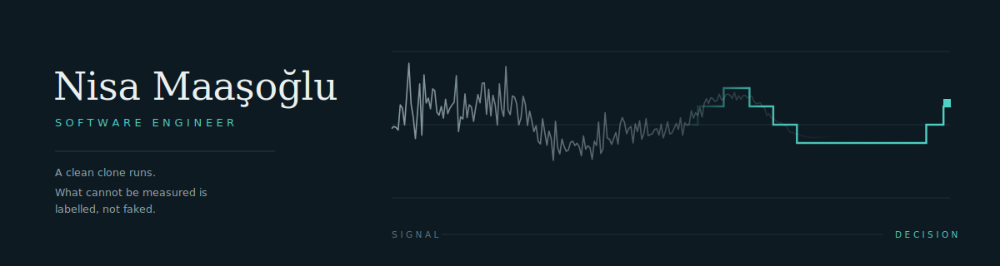

I build systems where a live signal has to become a decision: a microphone, an electrode, a
camera frame, a retrieved paragraph. The sensor is never the interesting part. The
interesting part is what you are allowed to conclude from it, and how the system behaves
when the honest answer is *not yet*.

Most of what follows is an attempt to answer that question in different domains.

---

## Two things I build

**Retrieval-grounded AI systems.** Agents that can only answer from what they actually
retrieved, with the guardrail in front of the model rather than behind it.
→ **[Anamnesis](https://github.com/nisamaasoglu/Anamnesis)**

**Production web systems.** Software that goes to a real client, holds their content, and
keeps working after I stop touching it.
→ **[Titulus](https://github.com/nisamaasoglu/Titulus)** — live, in daily use

---

## Projects

| | What it does | Run it |
|---|---|---|
| 🏥 **[Anamnesis](https://github.com/nisamaasoglu/Anamnesis)**<br><sub>RAG · Agents · FastAPI</sub> | A hospital information assistant that can only answer from what it retrieved. Tool-calling agent over a policy library and a synthetic record set. Clinical questions are refused *before* the agent runs, and there is no write path at all — not a disabled one, a missing one. | `python run.py`<br><sub>no API key, no network</sub> |
| ⚖️ **[Titulus](https://github.com/nisamaasoglu/Titulus)**<br><sub>PHP · Production · Live</sub> | A website for a real-estate law practice, in daily use. A 2,468-article legislation library, a daily Official Gazette feed, and a database-free admin panel the lawyer runs himself without calling me. | [live site](https://www.avukatmetinmaasoglu.com)<br><sub>source private</sub> |
| 🧠 **[LetheFS](https://github.com/nisamaasoglu/LetheFS)**<br><sub>Systems · Cognition</sub> | An autonomous forgetting file system. Recall scores decay along the Ebbinghaus curve into a reversible quarantine you resolve from a live dashboard. Nothing is ever deleted silently. | `python run.py`<br><sub>sandboxed by default</sub> |
| 🤖 **[Unicorn](https://github.com/nisamaasoglu/Unicorn)**<br><sub>ESP32 · C++ · Robotics</sub> | A solar search-and-rescue rover that raises its own Wi-Fi and serves a command centre from flash. It reports its position as a disc with a growing radius, because it has no wheel encoders — and says so. | `./tools/run_tests.sh`<br><sub>no board required</sub> |
| ❤️ **[Cardia](https://github.com/nisamaasoglu/Cardia)**<br><sub>IoT · Signal Processing</sub> | A single-lead ECG monitor. An AD8232 and an Arduino detect R-peaks on-device — adaptive threshold, refractory window, interval gating — and stream heart rate to a dependency-free dashboard. | `cd web && python3 -m http.server`<br><sub>falls back to a synthetic ECG</sub> |
| 🎵 **[Aurora](https://github.com/nisamaasoglu/Aurora)**<br><sub>Audio · GLSL</sub> | Real-time generative art. Live pitch, timbre and loudness drive a volumetric raymarching shader; every session is a one-time, non-repeatable piece. | `python main.py`<br><sub>no mic → simulation</sub> |
| 🧬 **[Helixir](https://github.com/nisamaasoglu/Helixir)**<br><sub>Cryptography · Desktop</sub> | File encryption with a DNA representation layer. AES-256-GCM with scrypt; the ciphertext is rendered as an A/C/G/T sequence and exported to FASTA. The DNA layer is representation, not the cipher. | `python run.py`<br><sub>PyQt6 desktop app</sub> |
| 🌸 **[Orchidia](https://github.com/nisamaasoglu/Orchidia)**<br><sub>Vision · Flask</sub> | Orchid identification and care. A classifier reads the species from a photo, then checks environmental readings against that species' ideal range. | `python app.py`<br><sub>demo backend, no model needed</sub> |
| 🎯 **[BOZGUN](https://github.com/nisamaasoglu/BOZGUN)**<br><sub>OpenCV · Serial</sub> | A colour-tracking turret. OpenCV maps a target's pixel position to pan/tilt servo angles over serial and marks it with a laser. Simulated hit, no projectile. | `python bozgun.py --demo`<br><sub>no webcam, no Arduino</sub> |

Every command above is the whole setup. That is deliberate: a reviewer with five minutes
should watch the pipeline run, not fight an install.

---

## What I got wrong

Portfolios show finished things, which makes them all look equally easy. These are real
defects I found in my own work and the specific change each one forced. I think they say
more than the feature lists above.

| Project | What was wrong | What I did about it |
|---|---|---|
| **Anamnesis** | The offline hashing vectoriser collided. A question about currency hedging retrieved a triage document at score 0.11 — a quiet false positive that makes a RAG demo look fine and be wrong. | Added a lexical gate: a passage must share a real term with the query before it counts as evidence. Two tests cover it — one asserting off-topic queries return nothing, one asserting that *without* the gate they would not, so the guard cannot be removed silently. |
| **Cardia** | The dashboard displayed a blood-pressure figure. An AD8232 cannot measure blood pressure. | Removed it. Panels for values the hardware genuinely cannot produce are gone; the ones that are modelled are labelled as modelled. |
| **Unicorn** | Position was reported as a coordinate. With no wheel encoders, dead reckoning drifts, and a bare coordinate hides that completely. | Position is now a disc with an uncertainty radius, and the radius uses different constants depending on whether the run is calibrated. |
| **Unicorn** | Two motor pins sat on ESP32 strapping pins, and a blocking `pulseIn` stalled the control loop. | Repinned; replaced the blocking read. Both were caught by moving the mission logic off the board so it could be tested on a host. |
| **Helixir** | The README framed the DNA layer as part of the encryption. It is not — encoding is not encryption. | Reframed throughout. AES-256-GCM does the work; the A/C/G/T layer is a representation, and the README says so before it says anything else. |
| **Orchidia** | The interface said "live conditions" over readings that were simulated. | Now says simulated, in the UI and in the docs. |

The pattern is the same every time: the bug was never the algorithm. It was a claim the
system was not entitled to make.

---

## Check my work in five minutes

Not a request to take any of this on trust.

```bash
# 1. A grounded answer, and the evidence it came from
git clone https://github.com/nisamaasoglu/Anamnesis && cd Anamnesis
pip install -r requirements.txt && python run.py
#    ask: "What are the visiting hours in the intensive care unit?"
#    → the answer names the document and section it used
#    ask: "Do I have cancer?"
#    → refused before any tool runs, with the route to a human

# 2. The tests that hold it together
pip install -r requirements-dev.txt && python -m pytest -q      # 45 passing

# 3. Firmware logic, verified with no hardware attached
git clone https://github.com/nisamaasoglu/Unicorn && cd Unicorn
./tools/run_tests.sh
```

Anamnesis 45 · Helixir 25 · Aurora 16 · Orchidia 13, plus Unicorn's host-compiled C++ suite.
CI runs `ruff` and `pytest` on Python 3.10–3.12 on every push.

---

## How I work

- **Test the decision, not the device.** The logic that decides *is this a heartbeat, is this
  a survivor, has this file been forgotten, is this passage evidence* is separated from the
  hardware or the model that feeds it — so it is testable on a laptop with nothing attached.
- **State the uncertainty.** An estimate that reports its own error is worth more than a
  confident number that quietly lies.
- **Document what exists.** No roadmaps, no planned features, no claim I could not defend in
  a technical interview.
- **Say which mode you are in.** Anamnesis reports `generative: false` when no model is
  running. Cardia prints `--` when no electrode is attached. Orchidia labels simulated
  readings as simulated. A system that hides which mode it is in is lying politely.

---

## Working with

`Python` · `PHP` · `C++` · `C#` · `JavaScript` · `SQL`
`FastAPI` · `Flask` · `Laravel` · `.NET` · `React` · `PyQt6`
`RAG` · `tool-calling agents` · `LLM APIs` · `OpenCV` · `librosa` · `scikit-learn`
`Docker` · `GitHub Actions` · `SQLite` · `Arduino / ESP32` · `Linux`

---

**Open to software engineering roles.**
[LinkedIn](https://linkedin.com/in/nisamaasoglu) · [nisamaasoglu7@gmail.com](mailto:nisamaasoglu7@gmail.com)
